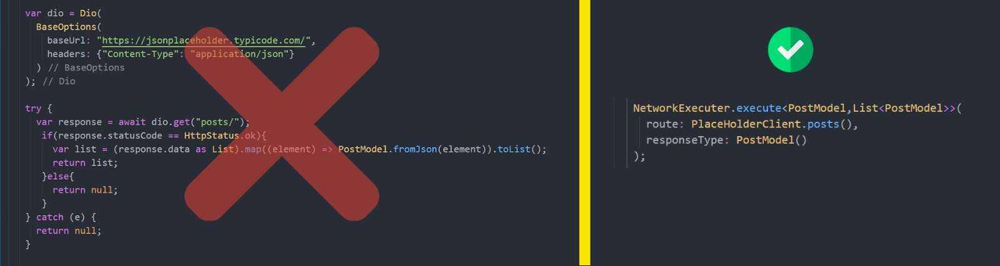
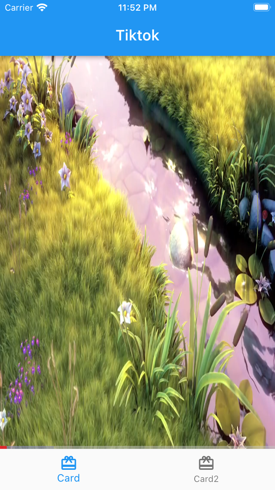

# Tiktok-Clone

With Tiktok-Clone, you can view you favourite videos.


Features:
used MVVM, Provider and dependency injection, you can dynamically decode models, handle network errors, and create dynamic requests for each client.


<!--  -->
<!-- 
 -->

   


## Use Of

**Network Executer**

```dart
NetworkExecuter.execute<PostModel,List<PostModel>>(route: PlaceHolderClient.posts(), responseType: PostModel());
```

**Network Errors**

```dart
NetworkError.request({required DioError error})
NetworkError.type({String? error})
```

## Packages used
```yaml
freezed
json_annotation
dio
video_player
Get_it
Provider
```


